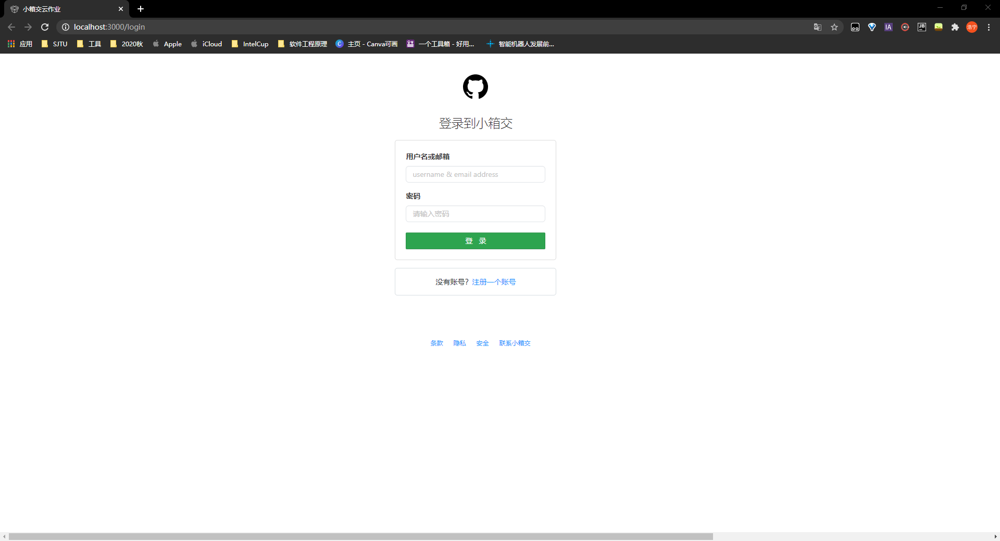
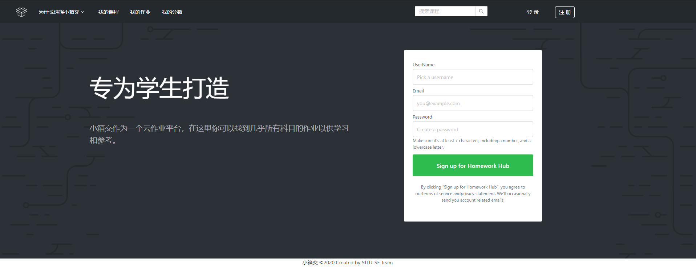
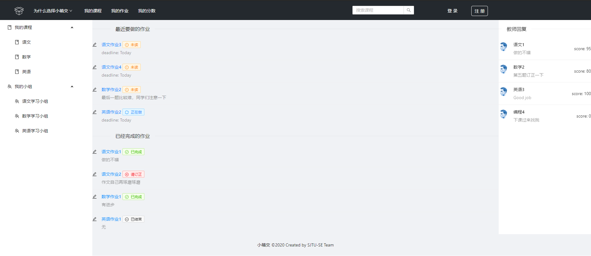
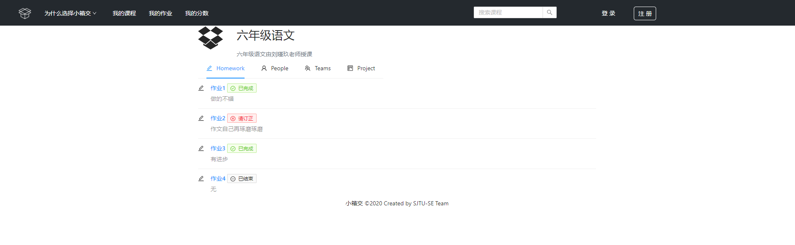
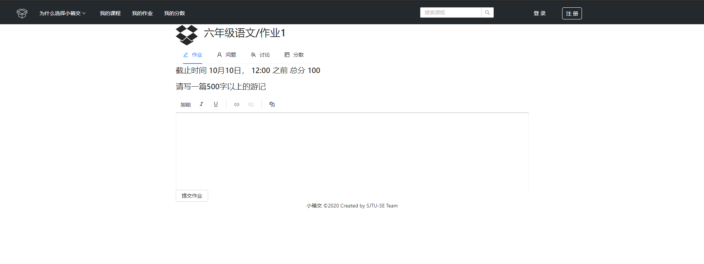

# 前端界面原型

这里是我们的小箱交云作业平台的前端原型，目前完成了登录、注册、主页、课程详情，作业详情界面

[TOC]

## 登录

### 地址

http://localhost:3000/login

（PS：注意 src/routes/LoginRouter.js中第九行的isAuthed修改为false，src/routes/PrivateRouter.js中第九行的isAuthed修改为false）

### 示例

## 注册

### 地址

http://localhost:3000/login

（PS：注意 src/routes/LoginRouter.js中第九行的isAuthed修改为true，src/routes/PrivateRouter.js中第九行的isAuthed修改为true，以下相同）

### 示例

## 主页

### 地址

http://localhost:3000/

### 示例

## 课程详情

### 地址

http://localhost:3000/class

### 示例

## 作业详情

### 地址

http://localhost:3000/homework

### 示例

